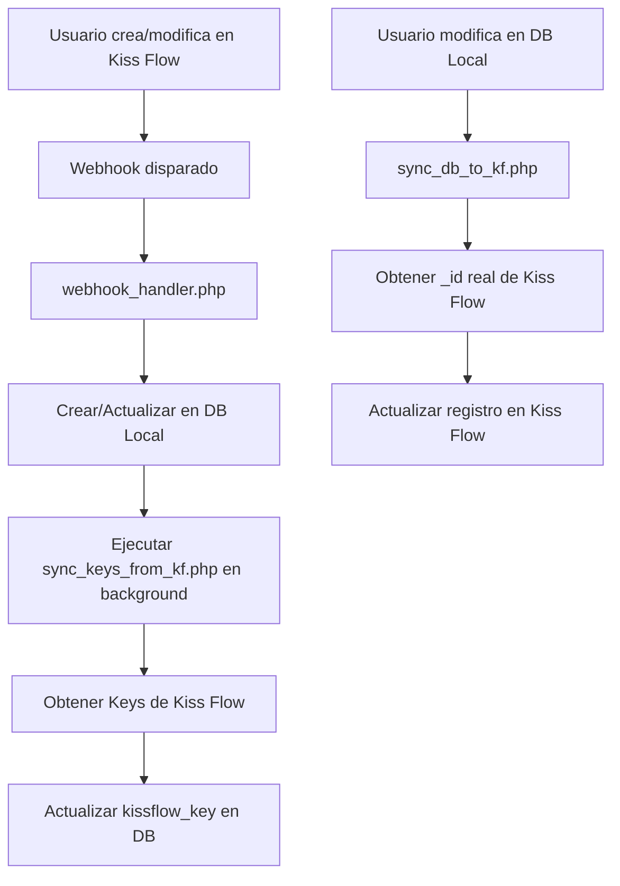

# Sistema de Sincronización Bidireccional con Kiss Flow

## Descripción General

Este sistema implementa una **sincronización bidireccional** entre una base de datos local y el dataset `DS_Documentos_Cliente` de Kiss Flow. Permite mantener los datos sincronizados en ambas direcciones:

- **Kiss Flow → DB Local**: Webhooks automáticos cuando se crean/modifican registros en Kiss Flow
- **DB Local → Kiss Flow**: Sincronización masiva de cambios locales hacia Kiss Flow

## Arquitectura del Sistema

### Flujo de Sincronización



## Archivos del Sistema

### 1. `webhook_handler.php`
**Propósito**: Endpoint principal que recibe webhooks de Kiss Flow cuando se crean/modifican registros.

**Funcionalidades**:
- Recibe payloads JSON de Kiss Flow
- Valida datos de entrada (cédula obligatoria)
- Crea o actualiza usuarios en la tabla `usuario`
- Crea o actualiza propiedades en la tabla `propiedad`
- Ejecuta automáticamente sincronización de keys en background
- Maneja transacciones de base de datos
- Logs detallados de todas las operaciones

**Endpoints**:
- `POST /api/webhook_rdc/webhook_handler.php`

**Campos sincronizados desde Kiss Flow**:
- `Identificacion` → `usuario.cedula`
- `Nombre_de_Cliente` → `usuario.nombres` + `usuario.apellidos`
- `Numero_de_Convenio` → `usuario.kissflow_convenio`
- `Mz_Solar` → `propiedad.manzana` + `propiedad.villa`
- `_id` → `propiedad.kissflow_ds_id`

### 2. `sync_db_to_kf.php`
**Propósito**: Sincroniza cambios desde la base de datos local hacia Kiss Flow.

**Funcionalidades**:
- Detecta registros modificados usando `last_modified` timestamps
- Obtiene el `_id` real de Kiss Flow usando `kissflow_key`
- Actualiza registros existentes en Kiss Flow
- Crea nuevos registros cuando no existe `kissflow_key`
- Maneja rate limiting con delays y reintentos
- Logs detallados de sincronización

**Campos sincronizados hacia Kiss Flow**:
- `usuario.cedula` → `Identificacion`
- `usuario.nombres` + `usuario.apellidos` → `Nombre_Cliente`
- `usuario.correo` → `Comentario_Gerencia`
- `usuario.telefono` → `Tipo_de_Fachada`
- `usuario.kissflow_convenio` → `Convenio`
- `etapa_construccion.nombre` → `Etapa`
- `tipo_propiedad.nombre` → `Modelo`
- `propiedad.manzana` + `propiedad.villa` → `Mz_Solar`
- `propiedad.kissflow_proyecto` → `Proyecto`
- `propiedad.fecha_entrega` → `Fecha_de_Entrega`

### 3. `sync_keys_from_kf.php`
**Propósito**: Obtiene y actualiza los Keys (Name) de Kiss Flow en la base de datos local.

**Funcionalidades**:
- Consulta todos los registros de Kiss Flow
- Busca usuarios locales sin `kissflow_key`
- Actualiza el campo `kissflow_key` con el valor `Name` de Kiss Flow
- Usa timestamps para sincronización incremental
- Maneja rate limiting con delays

**Uso**:
- Se ejecuta automáticamente después de webhooks
- Se puede ejecutar manualmente para llenar keys faltantes

### 4. `run_sync_keys.php`
**Propósito**: Wrapper para ejecutar la sincronización de keys.

**Funcionalidades**:
- Incluye y ejecuta `sync_keys_from_kf.php`
- Usado por el webhook para ejecución en background

### 5. `sync_ds_cliente.php`
**Propósito**: Sincronización masiva inicial desde Kiss Flow hacia la base de datos local.

**Funcionalidades**:
- Carga todos los registros de Kiss Flow
- Crea usuarios y propiedades masivamente
- Útil para migración inicial o recuperación

### 6. `debug_kissflow_record.php`
**Propósito**: Herramienta de debugging para consultar registros específicos en Kiss Flow.

**Funcionalidades**:
- Busca registros por cédula o convenio
- Muestra `_id`, `Name` (Key), y otros campos
- Útil para diagnosticar problemas de sincronización

## Configuración de Base de Datos

### Campos Agregados

```sql
-- Tabla usuario
ALTER TABLE `usuario`
ADD COLUMN `kissflow_key` VARCHAR(255) COLLATE utf8_unicode_ci DEFAULT NULL 
COMMENT 'Key de registro en Kiss Flow para actualizaciones';

-- Tabla propiedad  
ALTER TABLE `propiedad`
ADD COLUMN `kissflow_ds_id` VARCHAR(255) COLLATE utf8_unicode_ci DEFAULT NULL 
COMMENT 'ID del registro en Kiss Flow';

-- Campos last_modified para tracking de cambios
ALTER TABLE `usuario` 
ADD COLUMN `last_modified` TIMESTAMP DEFAULT CURRENT_TIMESTAMP ON UPDATE CURRENT_TIMESTAMP;

ALTER TABLE `propiedad`
ADD COLUMN `last_modified` TIMESTAMP DEFAULT CURRENT_TIMESTAMP ON UPDATE CURRENT_TIMESTAMP;
```

## Archivos de Configuración

### `config/db.php`
Configuración de conexión a la base de datos local.

### `../../kiss_flow/config.php`
Configuración de credenciales de Kiss Flow:
- `KISSFLOW_API_HOST`
- `KISSFLOW_ACCESS_KEY_ID`
- `KISSFLOW_ACCESS_KEY_SECRET`

## Archivos de Logs

### `sync_log.txt`
Log principal del webhook con todas las operaciones de creación/actualización.

### `sync_db_to_kf_log.txt`
Log de sincronización desde DB local hacia Kiss Flow.

### `sync_keys_log.txt`
Log de sincronización de keys desde Kiss Flow.

### `last_sync_timestamp.txt`
Timestamp de la última sincronización para tracking incremental.

### `last_keys_sync_timestamp.txt`
Timestamp de la última sincronización de keys.

## Flujo de Trabajo

### Creación de Usuario Nuevo

1. **Usuario crea registro en Kiss Flow**
2. **Webhook disparado** → `webhook_handler.php`
3. **Crea usuario** en DB local con `kissflow_ds_id`
4. **Crea propiedad** asociada
5. **Ejecuta** `sync_keys_from_kf.php` en background
6. **Obtiene Key** de Kiss Flow y actualiza `kissflow_key`
7. **Usuario listo** para sincronización bidireccional

### Actualización de Usuario Existente

1. **Usuario modifica en Kiss Flow**
2. **Webhook disparado** → `webhook_handler.php`
3. **Actualiza usuario** existente en DB local
4. **Actualiza propiedad** asociada

### Sincronización desde DB Local

1. **Usuario modifica en DB local**
2. **Ejecuta** `sync_db_to_kf.php`
3. **Detecta cambios** usando `last_modified`
4. **Obtiene `_id` real** usando `kissflow_key`
5. **Actualiza registro** en Kiss Flow

## Manejo de Errores

### Rate Limiting
- Delays de 0.5 segundos entre requests
- Reintentos con backoff exponencial (2s, 4s, 8s)
- Manejo de errores HTTP 429

### Duplicados
- Uso de `kissflow_key` para identificar registros únicos
- Validación de `_id` real antes de actualizar
- Logs detallados para debugging

### Fallbacks
- Si falla obtención directa de Key, busca en lista completa
- Si falla sincronización inmediata, se ejecuta en background
- Timestamps para recuperación de sincronización

## Endpoints de Kiss Flow Utilizados

### Listar Registros
```
GET /dataset/2/AcNcc9rydX9F/DS_Documentos_Cliente/list
```

### Obtener Registro Específico
```
GET /dataset/2/AcNcc9rydX9F/DS_Documentos_Cliente/record/{_id}
```

### Actualizar/Crear Registros (Batch)
```
POST /dataset/2/AcNcc9rydX9F/DS_Documentos_Cliente/batch
```

## Consideraciones de Rendimiento

- **Sincronización incremental** usando timestamps
- **Rate limiting** para evitar sobrecarga de API
- **Ejecución en background** para webhooks
- **Transacciones** para mantener consistencia
- **Logs estructurados** para monitoreo

## Mantenimiento

### Ejecutar Sincronización Manual / Cron Job Principal --> sync_db_to_kf.php Tarea programada cada 5 minutos
```bash
# Sincronizar keys faltantes
php sync_keys_from_kf.php

# Sincronizar cambios locales hacia Kiss Flow
php sync_db_to_kf.php

# Sincronización masiva inicial
php sync_ds_cliente.php
```

### Monitoreo
- Revisar logs regularmente
- Verificar timestamps de sincronización
- Monitorear errores de API
- Validar consistencia de datos

## Troubleshooting

### Problema: Registros duplicados
**Solución**: Ejecutar `sync_keys_from_kf.php` para llenar keys faltantes

### Problema: Errores 404 en webhook
**Solución**: Verificar que el registro existe en Kiss Flow con `debug_kissflow_record.php`

### Problema: Rate limiting
**Solución**: El sistema maneja automáticamente con delays y reintentos

### Problema: Keys no se actualizan
**Solución**: Verificar credenciales de Kiss Flow y conectividad de red
